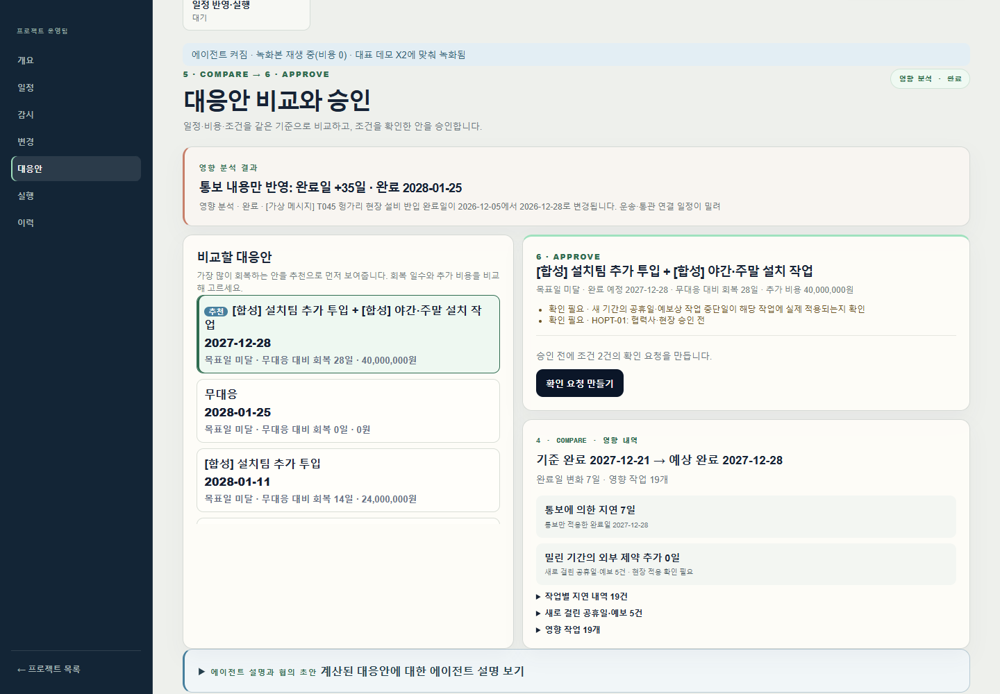
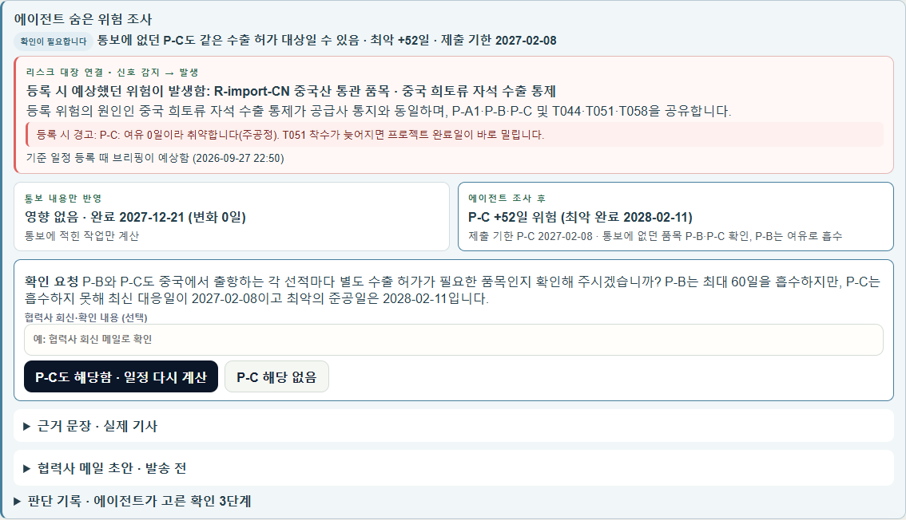
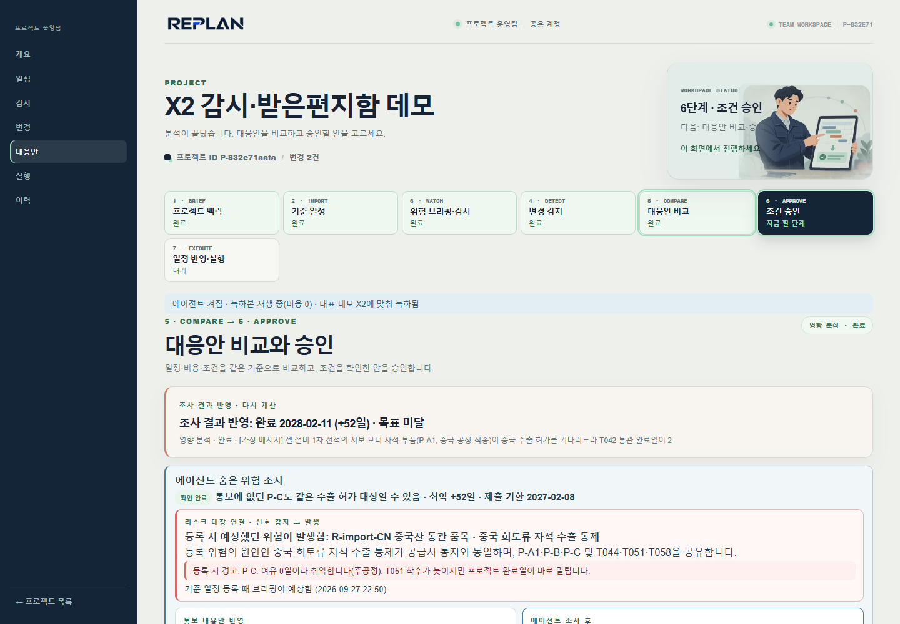

# REPLAN MVP

REPLAN은 설비 도입처럼 일정 의존성이 큰 프로젝트에서 **변경 신호를 근거와 함께 검토하고, 대응안을 계산·승인·반영하는 단일 팀용 작업공간**입니다.

협력사, 공공기관, 문서 작성자는 이 서비스의 사용자가 아닙니다. 프로젝트 운영팀이 하나의 공용 계정으로 기준 일정과 프로젝트 근거를 관리합니다.

## 현재 구현된 흐름

```text
기준 일정 Excel 연결
→ 변경 신호 등록 또는 외부 감시
→ 근거 검색·검토
→ 사람이 영향 작업·날짜·적용 조건 확인
→ 결정적 일정·비용 계산
→ 대응안 비교와 조건 승인
→ 새 일정 버전 확정·Excel 내보내기
```

| 단계 | 사용자가 하는 일 | 시스템이 보장하는 일 |
| --- | --- | --- |
| 기준 일정 | 기존 Excel을 연결하고 프로젝트 조건을 확인 | 원본 파일을 보존하고 작업·선후행·일정을 기준 버전으로 저장 |
| 변경 신호 | 메시지, 수정 Excel, 근거 문서를 등록하거나 외부 감시를 실행 | 입력을 변경 카드로 정리하고 중복·정정 이벤트를 구분 |
| 근거 검토 | 원문과 후보 작업을 보고 적용 여부를 확인 | 출처·수집 시각·원문 해시·인용 문장을 보존 |
| 영향 분석 | 확인된 작업·날짜·조건으로 분석 시작 | 계산기가 날짜·비용·제약을 계산 |
| 대응안 | 대안을 비교하고 필요한 확인 요청을 처리 | 예산·완료일·필수 조건을 명시 |
| 실행 | 승인된 안을 새 일정 버전으로 확정 | 확정 이력과 새 Excel을 생성 |

## 변경 신호와 외부 RAG

변경 신호는 “일정을 바꿀 수 있는 새 정보”입니다. 협력사 메시지, 수정된 Excel, 업로드 문서, 등록한 공식 출처의 공지, 공휴일·기상 감시 결과가 모두 여기에 해당합니다. 변경 신호 자체가 일정 변경은 아닙니다.

LIVE 외부 공지와 업로드 문서에는 다음 흐름을 적용합니다.

1. 프로젝트별 증거 저장소에 원문, 출처 URL 또는 문서 ID, 수집 시각, 해시를 보존합니다.
2. 원문을 인용 가능한 passage로 나누고 작업명·작업 ID·위험 태그·감시 키워드로 관련 문단을 검색합니다.
3. 검색된 근거, 작업 후보, 검색 기록을 변경 카드에 연결합니다.
4. 팀이 작업·날짜·적용 조건을 확인한 뒤에만 일정 계산을 시작합니다.
5. 승인 직전에는 원문 해시를 다시 확인합니다.

현재 RAG는 **프로젝트 내부 SQLite lexical RAG**입니다. 임의의 웹을 LLM이 탐색하지 않으며, 팀이 업로드했거나 감시 대상으로 등록한 출처만 읽습니다. 벡터 검색과 등록되지 않은 웹 탐색은 후속 운영 단계입니다.

## 에이전트와 사람의 역할

| 역할 | 담당 범위 | 하지 않는 일 |
| --- | --- | --- |
| RAG·규칙 | 근거 수집, 관련 문단·작업 후보 탐색 | 일정·비용 확정 |
| LLM 에이전트 | 검색된 문단 해석, 인용 포함 후보 제안, 조사 질문·메일 초안 | 임의 웹 검색, 일정 수정, 승인·확정·발송 |
| 계산기 | 날짜, 작업 의존성, 비용, 예산·제약 계산 | 원문 의미 추측 |
| 사람 | 적용 여부, 작업·날짜·조건, 대응안 승인 | - |

LLM에는 검색된 passage만 전달됩니다. 제안에는 citation ID와 원문 인용이 필요하며, 서버가 인용문이 실제 근거에 존재하는지 검증합니다. 사람이 확인하기 전에는 일정과 비용을 변경할 수 없습니다.

LLM이 설정되지 않았거나 일시적으로 연결되지 않아도 기준 일정·규칙·계산기는 동작합니다. 화면은 이를 “계산할 수 없음”이 아니라 **에이전트 연결 확인 필요**로 표시하고, 이미 계산된 결과는 유지합니다.

## 대표 데모

### H04 — 확인된 납기 변경의 대응안 비교

설비 반입 완료일이 늦어진 메시지를 입력하면, 계산기는 통보 지연과 밀린 기간에 새로 걸린 공휴일을 분리해 계산합니다. 운영팀은 여러 대응안의 완료일·추가 비용·조건을 비교하고, 필요한 확인을 마친 뒤 하나를 승인합니다.



### X2 — 근거 기반 숨은 위험 조사

협력사 메시지에 없는 같은 원인의 구매 품목이 있을 수 있는 사례입니다. 사용자가 조사를 시작하면 에이전트는 등록 공지와 검색된 프로젝트 근거를 읽고, 계산 도구로 여유와 조건부 영향을 확인합니다. 근거가 부족하면 일정 변경 대신 확인 요청과 메일 초안만 남깁니다.





자세한 화면 순서는 [데모 가이드](docs/DEMO_GUIDE.md)를 참고하세요.

## 실행

### 데모 재생 모드

```sh
cp .env.example .env
# .env에서 REPLAN_DEMO_TOKEN을 로컬 값으로 변경
scripts/demo.sh                # macOS·Linux
# Windows: scripts\demo.cmd
```

`http://localhost:3000`에서 **데모 보기 → 워크스페이스 열기 → 프로젝트 만들기** 순서로 실행합니다. 데모는 별도 데이터 공간에서 `REPLAN_LLM_MODE=replay`로 동작합니다. 녹화된 응답을 사용하므로 API 키·네트워크·비용 없이 대표 흐름을 재현합니다.

### 실제 LLM 모드

서버의 `.env`에만 다음 값을 설정합니다. `.env`, API 키, 프로젝트 데이터는 커밋하지 않습니다.

```env
API_KEY=...
LLM_BASE_URL=https://gateway.example/v1
LLM_MODEL=approved-model
REPLAN_PAID_CALLS_ENABLED=true
REPLAN_MAX_PAID_RUNS_PER_DAY=20
REPLAN_LLM_MODE=live
```

`record` 모드는 녹화본에 없는 요청만 실제로 호출해 저장하고, `replay` 모드는 녹화본만 사용합니다. 실제 호출은 사람이 시작한 근거 해석·정식 분석·조사에서만 발생합니다. 자동 감지와 잠정 미리보기는 LLM을 호출하지 않습니다.

### 구성

| 경로 | 역할 |
| --- | --- |
| `apps/web/` | Next.js 작업공간 화면 |
| `services/api/app/` | FastAPI, Excel 처리, 일정 계산기, RAG, 에이전트 런타임, worker |
| `services/api/app/evidence_rag.py` | 근거 문서 색인·검색·인용 연결 |
| `tests/test_evidence_rag.py` | 문서 → RAG → LLM 후보 → 검토 → 승인 E2E 검증 |
| `scripts/` | REPLAY·에이전트·외부 변화 평가 스크립트 |
| `data/` | 합성 프로젝트·데모 입력·재생 응답·평가 자료 |
| `docs/` | 제품 흐름, 데모, 연동, 배포, 감사 문서 |

Docker 없이 실행하려면 API(`uvicorn app.main:app --app-dir services/api`), worker(`PYTHONPATH=services/api python -m app.worker`), 웹(`apps/web`에서 `npm run dev`)을 같은 `REPLAN_DATA_DIR`와 `REPLAN_DEMO_TOKEN`으로 실행합니다. API 문서는 `http://localhost:8000/docs`에서 확인할 수 있습니다.

## 검증

```sh
./.venv/bin/python -m pytest -q
cd apps/web && npm run build
./.venv/bin/python scripts/evaluate_replay.py
./.venv/bin/python scripts/agent_flows.py --mode replay
```

현재 회귀 테스트는 일정 계산, 승인·내보내기, REPLAY, 외부 변화 감시, 근거 RAG, LLM 계약 흐름을 포함합니다. 실제 유료 모델 평가는 별도 환경에서 실행하며 호출 한도와 비용을 먼저 설정해야 합니다. 과거 평가 수치와 세부 개선 이력은 [에이전트 감사 기록](docs/AGENT_AUDIT.md)에 있습니다.

## 운영 범위와 문서

- [외부 변화 워크플로](docs/EXTERNAL_RISK_WORKFLOW.md): 감시 출처, RAG 범위, 근거 검토 규칙
- [연동 매트릭스](docs/INTEGRATION_MATRIX.md): 현재 연동과 운영 전제
- [AWS 배포 안내](deploy/aws/README.md): EC2·Docker Compose 배포 및 운영 확인
- [데모 가이드](docs/DEMO_GUIDE.md): 대표 시나리오 재생 순서

현재 MVP는 공용 팀 계정과 SQLite를 전제로 합니다. 인터넷 공개 운영 전에는 팀 인증, 비밀 관리, HTTPS, 백업·영속 볼륨, 운영 감시를 추가해야 합니다. 외부 공지와 문서는 일정 변경을 확정하지 않으며, 규제·인허가 정보는 사람의 적용 확인 전까지 조건부 검토 사건으로만 다룹니다.
